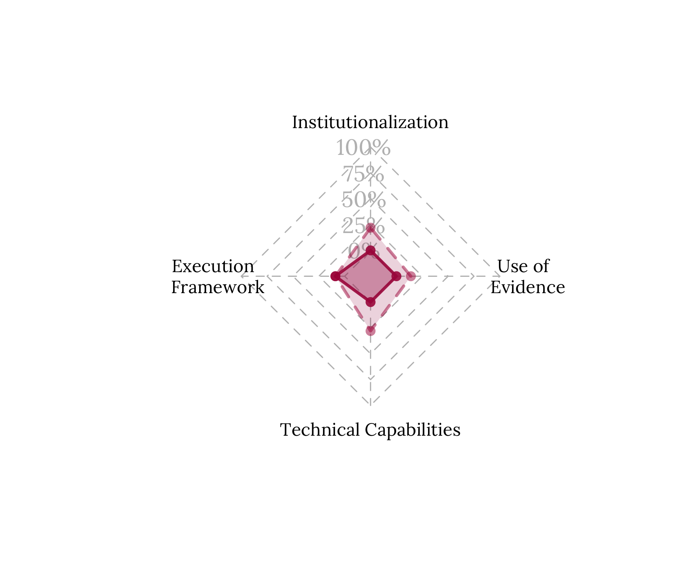
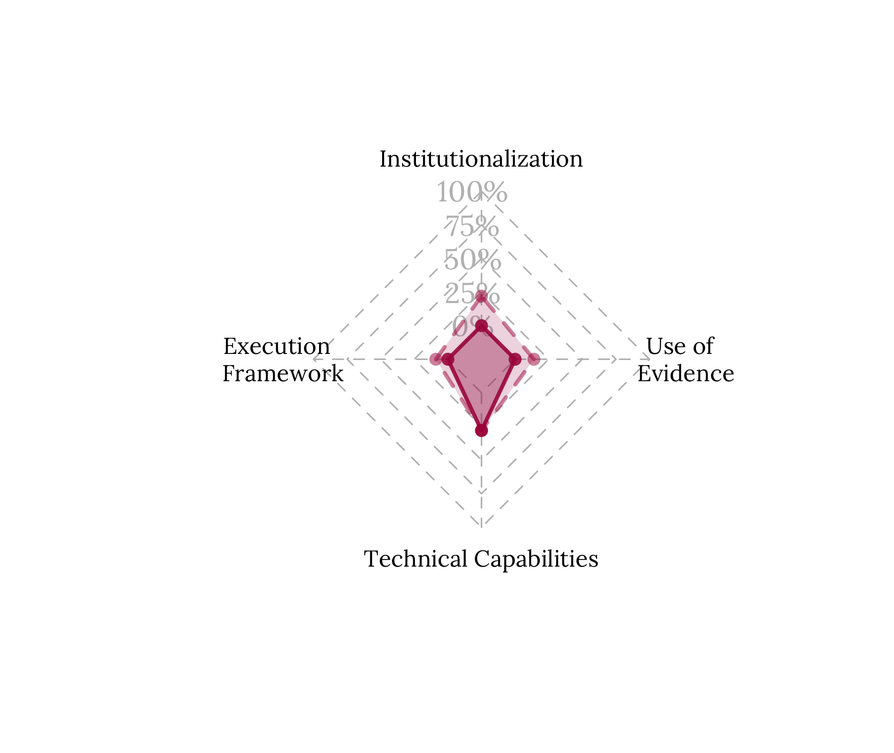

# Main findings {#section5}

As mentioned above, this Preparedness Diagnostic uses four dimensions analysis as a reference. Each dimension contains elements considered relevant to have an "Ideal RBM System". This Ideal RBM System will allow us to compare the current situation in Dominica in relation to the best possible scenario regarding RBM, its practices, uses and results. Figure 5 shows the progress rate of  each of the dimensions analysed, with respect to the ideal scenario.

The elements and sub-elements of the reference Ideal RBM System are not a “natural” condition. This means that each one must be designed and developed; following this, a country that has not considered adopting RBM practices would probably not comply or show advances in any of the analysed elements. In this sense, all the advances identified in this diagnosis represent valuable progress.

It is important to mention that, although there is a numerical value for each dimension, behind the numbers there was a qualitative analysis that determined the current situation of Dominica regarding RBM. Furthermore, these "ratings" are in terms of the ideal scenario, so in no way does it represent an outright success or failure, but rather a proxy to the best possible situation of the RBM.

+---------------------------+------------------------+
| DIMENSION                 | LEVEL OF PROGRESS      | 
+===========================+========================+
| INSTITUTIONALISATION      |    22%      | 
+---------------------------+-------------+
| EXECUTION FRAMEWORK       |    9%      | 
+---------------------------+-------------+
| TECHNICAL CAPABILITIES    |    28%      | 
+---------------------------+-------------+
| USE OF EVIDENCE           |    14%     | 
+---------------------------+-------------+

Table: (\#tab:table) Developed by the CLEAR LAC technical team in charge of the collaboration

(\#fig:figure5)Level of progress of the Ideal RBM System

Considering this level of progress, a metric was built to progressively identify five levels of maturity of RBM systems. In this way, the progress levels presented above are averaged to characterise the Member State’s level . The 5 levels are:

  1.	Early initiatives
  2.	Committed development
  3.	Growing RBM System
  4.	Consolidated practices
  5.	Mature State

Based on the results from the Preparedness Diagnostic analysis, Dominica is currently in the Early initiatives level. Significant efforts have been made in developing and implementing a results-oriented national planning with clear strategies that contribute to the achievement of Dominica’s higher goal of climate resiliency. There are also initial efforts in monitoring activities; however, they are not articulated and there are no clear responsible stakeholders in the monitoring process. It is pending for Dominica to start the drafting of an RBM Policy and the building of a whole-of-government, to develop evaluation activities, to define an incentives structure to build an enabling environment that ensures the sustainability of an RBM System.

##	Results by dimension 

The results of this diagnosis for each of the dimensions analysed (and their ideal elements) are presented below in a synthetic manner. For more detailed information on each dimension, elements, and sub-elements, please see [appendix C](#appendixC) and visit the interactive platform with all the disaggregated findings of this PD.

### Institutionalisation 

|    Key Message  |
|:-------------------------------------|:----------|
|    Dominica has broad normative frameworks in planning, significant advances in budgeting, and slight advances in monitoring. The Climate Resilience Executive Agency for Dominica (CREAD), a cross-cutting and temporary institution created to achieve Dominica's long-term goal (become the first climate resilient nation), plays a relevant role in supporting MDAs in the monitoring and implementation of programmes. However, there are not enough norms and clear responsibilities to foster the continuous improvement in planning, budgeting, and implementation based on the use of M&E results, and to articulate a whole of government RBM system.      |     |
|           |                      |  

<table class=" lightable-paper lightable-striped" style='font-size: 12px; font-family: "Arial Narrow", arial, helvetica, sans-serif; margin-left: auto; margin-right: auto;'>
 <thead>
  <tr>
   <th style="text-align:left;"> Ideal Element </th>
   <th style="text-align:left;"> Main results/findings </th>
  </tr>
 </thead>
<tbody>
  <tr>
   <td style="text-align:left;font-weight: bold;border-right:1px solid;"> 1. There is a documented, approved, and binding RBM Policy within the government </td>
   <td style="text-align:left;width: 33em; "> Dominica doesn’t have a draft of an RBM policy yet. CREAD recommends the adoption of the CARICOM Results-Based System, a monitoring, evaluation, and reporting framework. </td>
  </tr>
  <tr>
   <td style="text-align:left;font-weight: bold;border-right:1px solid;"> 2. There are laws/regulations/norms recognizing M&amp;E activities across the government </td>
   <td style="text-align:left;width: 33em; "> The CREAD Act grants CREAD the responsibility to “monitor progress against reconstruction targets and evaluate the social and economic impact of interventions”. However, it is not clear if M&amp;E activities are to be performed by the agency. Additionally, the government of Dominica is currently developing a M&amp;E framework for the Public Sector Investment Program (PSIP). </td>
  </tr>
  <tr>
   <td style="text-align:left;font-weight: bold;border-right:1px solid;"> 3. There are guidelines that establish the rules and processes to perform monitoring activities </td>
   <td style="text-align:left;width: 33em; "> In practice, the MDAs deliver a monthly progress report to the Ministry of Planning. However, there is no framework guiding and regulating the monitoring activities of public policies in Dominica. </td>
  </tr>
  <tr>
   <td style="text-align:left;font-weight: bold;border-right:1px solid;"> 4. There are guidelines that establish the rules and processes to perform evaluation activities </td>
   <td style="text-align:left;width: 33em; "> There is no framework guiding and regulating the evaluation activities of public policies in Dominica. </td>
  </tr>
  <tr>
   <td style="text-align:left;font-weight: bold;border-right:1px solid;"> 5. There are guidelines that establish the rules and processes to address and use of M&amp;E results </td>
   <td style="text-align:left;width: 33em; "> There are no publicly available frameworks or guidelines regulating the use of M&amp;E results in Dominica. </td>
  </tr>
  <tr>
   <td style="text-align:left;font-weight: bold;border-right:1px solid;"> 6. There are formal actions towards building an enabling environment </td>
   <td style="text-align:left;width: 33em; "> There are no formal actions identified toward building an enabling environment. </td>
  </tr>
  <tr>
   <td style="text-align:left;font-weight: bold;border-right:1px solid;"> 7. There is a Results Oriented National Plan defined for a given period in the country </td>
   <td style="text-align:left;width: 33em; "> There are two national planning exercises defined for a long-term period: the National Resilience Development Strategy (NRDS) 2030 and the Climate Resilience and Recovery Plan 2020-2030 (CRRP), that fully operationalizes the NRDS. </td>
  </tr>
  <tr>
   <td style="text-align:left;font-weight: bold;border-right:1px solid;"> 8. There is a national budgeting strategy for a given period in the country: </td>
   <td style="text-align:left;width: 33em; "> Dominica has a three-year national budgeting strategy divided in two “sides”: capital projects/development (PSIP) and recurrent expenditures. The Ministry of Planning oversees the development side and the Ministry of Finance of the recurrent side. Finance is overall responsible for the compilation of the budget (capital and recurrent). </td>
  </tr>
</tbody>
</table>

### Execution Framework 

|    Key Message  |
|:-------------------------------------|:----------|
|    The Ministry of Planning gathers monthly reports from all the MDAs regarding their performance. Also, both national planning documents (NRDS and CRRP) have monitoring frameworks. However, these monitoring exercises are not structured in a clear process and are not articulated. There is no common language among MDAs around M&E as well as no M&E network to perform M&E activities.  Also, there is no transparency regarding the monitoring activities and the results.      |     |
|           |                      |  

<table class=" lightable-paper lightable-striped" style='font-size: 12px; font-family: "Arial Narrow", arial, helvetica, sans-serif; margin-left: auto; margin-right: auto;'>
 <thead>
  <tr>
   <th style="text-align:left;"> Ideal Element </th>
   <th style="text-align:left;"> Main results/findings </th>
  </tr>
 </thead>
<tbody>
  <tr>
   <td style="text-align:left;font-weight: bold;border-right:1px solid;"> 9. There are operative handbooks to implement the monitoring functions (i.e. Logic Framework) </td>
   <td style="text-align:left;width: 33em; "> In practice, the MDAs deliver a monthly progress report to the Ministry of Planning. Also, there are monitoring instruments in the national planning documents. However, there are no operative handbooks to implement the monitoring functions. </td>
  </tr>
  <tr>
   <td style="text-align:left;font-weight: bold;border-right:1px solid;"> 10. There are operative handbooks that establish specific steps to develop each stage of the evaluation function </td>
   <td style="text-align:left;width: 33em; "> There are no operative handbooks that define and establish specific steps to develop each stage of the evaluation function. </td>
  </tr>
  <tr>
   <td style="text-align:left;font-weight: bold;border-right:1px solid;"> 11. There is an operating and functioning coordination of M&amp;E at the national or/and subnational levels </td>
   <td style="text-align:left;width: 33em; "> The MDAs deliver a monthly progress report to the Ministry of Planning, entity who coordinates these efforts. These reports allow the Ministry of Planning to track if the interventions implemented by the MDAs are delivering the expected results, to achieve the defined targets in the national planning. </td>
  </tr>
  <tr>
   <td style="text-align:left;font-weight: bold;border-right:1px solid;"> 12. There is a defined human resources structure for M&amp;E activities </td>
   <td style="text-align:left;width: 33em; "> There is no defined human resource structure for M&amp;E activities across government. Also, it was mentioned that some MDAs lack a specific unit responsible of M&amp;E activities. </td>
  </tr>
</tbody>
</table>

### Technical capabilities

|    Key Message  |
|:-------------------------------------|:----------|
|    There are skills to conduct planning, budgeting, and monitoring for results. The creation of CREAD and the development of the CRRP has translated the national's planning into action with clear priorities and targets to be achieved. The national budgeting function is fulfilled based on the collaboration between planning and finance. Also, ministries such as planning conduct regular monitoring, coordinating with the other MDAs. However, these skills are not homogeneous among MDAs.      |     |
|           |                      |  

<table class=" lightable-paper lightable-striped" style='font-size: 12px; font-family: "Arial Narrow", arial, helvetica, sans-serif; margin-left: auto; margin-right: auto;'>
 <thead>
  <tr>
   <th style="text-align:left;"> Ideal Element </th>
   <th style="text-align:left;"> Main results/findings </th>
  </tr>
 </thead>
<tbody>
  <tr>
   <td style="text-align:left;font-weight: bold;border-right:1px solid;"> 13. There are sufficient private and public entities providing M&amp;E services, including training, to the public sector </td>
   <td style="text-align:left;width: 33em; "> There aren’t sufficient entities providing continuous capacity building activities in M&amp;E. The World Bank and the Caribbean Development Bank have provided M&amp;E training to some MDAs such as the Ministry of Agriculture. Additionally, CREAD started developing a capacity building programme; however, it isn’t clear if it includes M&amp;E courses. </td>
  </tr>
  <tr>
   <td style="text-align:left;font-weight: bold;border-right:1px solid;"> 14. There are skilled personnel in government with technical capacity and competencies to conduct planning and budgeting for results </td>
   <td style="text-align:left;width: 33em; "> The Ministry of Planning and the Office of the Cabinet Secretary has staff with high competences in planning. The Ministry of Planning and the Ministry of Finance has staff with high competences in budgeting. </td>
  </tr>
  <tr>
   <td style="text-align:left;font-weight: bold;border-right:1px solid;"> 15. There are skilled personnel in government with technical capacity and competencies to conduct monitoring activities </td>
   <td style="text-align:left;width: 33em; "> The Ministry of Planning has staff with high competences in monitoring. </td>
  </tr>
  <tr>
   <td style="text-align:left;font-weight: bold;border-right:1px solid;"> 16. There are skilled personnel in government with technical capacity and competencies to conduct evaluations and evaluation activities: </td>
   <td style="text-align:left;width: 33em; "> No MDAs were identified with high skills in evaluation. </td>
  </tr>
</tbody>
</table>

### Use of evidence

|    Key Message  |
|:-------------------------------------|:----------|
|    There are skills to conduct planning, budgeting, and monitoring for results. The creation of CREAD and the development of the CRRP has translated the national's planning into action with clear priorities and targets to be achieved. The national budgeting function is fulfilled based on the collaboration between planning and finance. Also, ministries such as planning conduct regular monitoring, coordinating with the other MDAs. However, these skills are not homogeneous among MDAs.      |     |
|           |                      |  

<table class=" lightable-paper lightable-striped" style='font-size: 12px; font-family: "Arial Narrow", arial, helvetica, sans-serif; margin-left: auto; margin-right: auto;'>
 <thead>
  <tr>
   <th style="text-align:left;"> Ideal Element </th>
   <th style="text-align:left;"> Main results/findings </th>
  </tr>
 </thead>
<tbody>
  <tr>
   <td style="text-align:left;font-weight: bold;border-right:1px solid;"> 17. RBM documents and government performance information are available and accessible for consultation </td>
   <td style="text-align:left;width: 33em; "> National planning and budgeting documents are publicly available and accessible to download in official websites. However, there are no available documents regarding the monitoring of activities performed by the government. </td>
  </tr>
  <tr>
   <td style="text-align:left;font-weight: bold;border-right:1px solid;"> 18. There is an enabling environment for the use of M&amp;E results </td>
   <td style="text-align:left;width: 33em; "> There were no incentives identified to enhance the development of an enabling environment for the use of M&amp;E results. </td>
  </tr>
  <tr>
   <td style="text-align:left;font-weight: bold;border-right:1px solid;"> 19. M&amp;E results are systematically included in the planning &amp; budgeting </td>
   <td style="text-align:left;width: 33em; "> There are monitoring instruments to track the national planning documents. However, it is not clear if there is a systematic procedure to include the results of the monitoring activities in the planning and budgeting. </td>
  </tr>
  <tr>
   <td style="text-align:left;font-weight: bold;border-right:1px solid;"> 20. The government has mechanisms to measure the use of the evidence that the RBM system generates </td>
   <td style="text-align:left;width: 33em; "> There is no evidence that the MDAs measure the use of evidence. </td>
  </tr>
</tbody>
</table>

##	Main challenges to strengthen the RBM system

As mentioned in section 2.2, the development of an RBM System is a complex, nonlinear, and continuous process that must be contextualized in each country. In doing so, it is important to consider the main challenges that Dominica faces when it comes to strengthening its RBM system. This diagnosis identifies three major challenges:

1.	Changing the culture and fostering the enabling environment to have an RBM system in place implies a change of mindset of public servants at all levels. It should be considered that throughout the process there must be a constant awareness/sensitization strategy, both in the short and medium term, that allows public servants to identify the importance to have this mindset change in pursuit of RBM. In other words, on a regular basis,  there needs to be reminders on the importance of RBM and its impact on improving performance and lives of all citizens

2.	Since this collaboration constitutes a whole-of-government approach, it is necessary to have a top-bottom commitment in which leaders and decision-makers demonstrate the benefits of the RBM system through evidence informed actions that are generated by the RBM system. This means that we need a top-bottom approach to use, and thereby demonstrate its usefulness, the information and evidence derived from the RBM system to improve planning and budgeting decisions.

3.	For the RBM system to be sustainable, it is critical to generate a system of incentives and ensure that there is a balance between positive and negative incentives (such as potential penalties for non-compliance), to advance and sustain the system. The positive incentives can take different forms, from monetary to symbolic, such as the presentation of awards to staff and units and recognition for good performance in public service.

