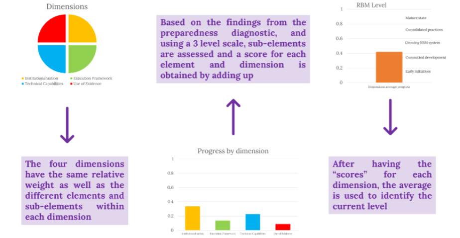

# (APPENDIX) Appendix {-}

# Conceptual framework (CLEAR LAC) {#appendixA}

## Key dimensions of a sustainable RBM System

The development of an RBM System is a complex and nonlinear process that must be contextualized to the specific region, country, or Regional Institution. However, the multiple efforts done over time allow us to learn from experiences in different settings and identify good practices. These good practices represent useful inputs to be considered when embarked on this road. 

One significant component to strengthen RBM in the Community is to build, in a participatory process, specific roadmaps to continue the development of RBM Systems for each pilot member state and Regional Institution. The Member States and Regional Institutions participating in the pilot have significant but heterogeneous advances achieving this goal. To identify these advances and guide the analysis of the Preparedness Diagnostic stages, the CLEAR LAC team defined four dimensions of an ideal and sustainable RBM System:

-	_Institutionalisation:_ this dimension focuses on the formal rules that defines, outlines and formalize the RBM Systems in the countries.

-	_Execution framework:_ this dimension focuses on the systems, resources, processes, methodologies, and tools necessary for the implementation of the RBM system, as well as incentives that promote an enabling environment.

-	_Technical capabilities:_ this dimension focuses on the capacities, abilities, and resources necessary to implement and sustain the RBM System.

-	_Use of evidence:_ this dimension focuses on the dissemination strategies and incentives aimed at stakeholders with the purpose that they use the evidence generated by the RBM System and its measurement.

##	Ideal elements & sub-elements

The four dimensions previously mentioned were conceptualized as necessary components when building an operating and sustainable RBM system. To have a better understanding of what the progress in each dimension entails, we propose a set of ideal elements and sub-elements taken from different contexts and experiences where they have been successfully implemented or recommended. Each dimension has a set of elements that represent activities, documents, normative frameworks, skills, incentives, etc.; and every element has a set of sub-elements that describe the ideal characteristics of the element. The sub-elements allow to translate concepts into practice, and, after gathering and analysing information, this knowledge can be translated into specific actions.

Unlike the dimensions, as RBM Systems are designed and built considering contextual factors, some elements and sub-elements should be taken as a guide as different contexts will result in variations on their interpretation and level of relevance/priorities. This framework allows for adaptations, recognizing that every context is particular and that there is no unique checklist that may apply to all contexts.

<table class=" lightable-paper lightable-striped" style='font-family: "Arial Narrow", arial, helvetica, sans-serif; width: auto !important; margin-left: auto; margin-right: auto;'>
<caption>(\#tab:unnamed-chunk-2)Institutionalisation Elements</caption>
 <thead>
  <tr>
   <th style="text-align:left;position: sticky; top:0; background-color: #FFFFFF;"> I. Institutionalisation Ideal elements </th>
  </tr>
 </thead>
<tbody>
  <tr grouplength="7"><td colspan="1" style="border-bottom: 1px solid;"><strong>1. There is a documented, approved and binding RBM Policy within the government:</strong></td></tr>
<tr>
   <td style="text-align:left;padding-left: 2em;" indentlevel="1"> It is relevant across the government at all levels </td>
  </tr>
  <tr>
   <td style="text-align:left;padding-left: 2em;" indentlevel="1"> It outlines guiding principles / pillars that are alligned to a results-oriented approach </td>
  </tr>
  <tr>
   <td style="text-align:left;padding-left: 2em;" indentlevel="1"> It communicates what RBM entails (i.e., clear definitions for key concepts) and clearly states how it works </td>
  </tr>
  <tr>
   <td style="text-align:left;padding-left: 2em;" indentlevel="1"> It identifies key actors who are responsible for the coordination and the measurement of the overall results of the RBM policy </td>
  </tr>
  <tr>
   <td style="text-align:left;padding-left: 2em;" indentlevel="1"> It identifies key actors who are responsible for supervising the implementation of the RBM policy and their functions (within the MDAs) </td>
  </tr>
  <tr>
   <td style="text-align:left;padding-left: 2em;" indentlevel="1"> It is use-oriented in planning, budgeting and implementing towards results (cronograma) </td>
  </tr>
  <tr>
   <td style="text-align:left;padding-left: 2em;" indentlevel="1"> The funding for M&amp;E activities and the responsibles are identified </td>
  </tr>
  <tr grouplength="6"><td colspan="1" style="border-bottom: 1px solid;"><strong>2. There are laws/regulations/norms* recognizing M&amp;E activities across the government</strong></td></tr>
<tr>
   <td style="text-align:left;padding-left: 2em;" indentlevel="1"> They are aditional to the RBM Policy </td>
  </tr>
  <tr>
   <td style="text-align:left;padding-left: 2em;" indentlevel="1"> They delegate M&amp;E responsibilities to a single national body or to multiple MDAs </td>
  </tr>
  <tr>
   <td style="text-align:left;padding-left: 2em;" indentlevel="1"> It is relevant across the government at all levels and branches (i.e. scope of action) and defines the M&amp;E subjects </td>
  </tr>
  <tr>
   <td style="text-align:left;padding-left: 2em;" indentlevel="1"> They stablish that the M&amp;E results affect planning, budgeting and implementing activities </td>
  </tr>
  <tr>
   <td style="text-align:left;padding-left: 2em;" indentlevel="1"> (If more than one) They are consistent with each other </td>
  </tr>
  <tr>
   <td style="text-align:left;padding-left: 2em;" indentlevel="1"> It stablishes the need to designate focal points in each MDA across government </td>
  </tr>
  <tr grouplength="7"><td colspan="1" style="border-bottom: 1px solid;"><strong>3. There are guidelines that establish the rules and processes to perform monitoring activities:</strong></td></tr>
<tr>
   <td style="text-align:left;padding-left: 2em;" indentlevel="1"> •They identify indicator types and the dimensions they want to measure (e.g., efficiency, efficacy), and monitoring tools (e.g., logic framework) to be developed for each project / social programme </td>
  </tr>
  <tr>
   <td style="text-align:left;padding-left: 2em;" indentlevel="1"> •They identify specific timeframes to collect indicator data and develop monitoring tools to measure the indicators (e.g., collect every six months) for each project </td>
  </tr>
  <tr>
   <td style="text-align:left;padding-left: 2em;" indentlevel="1"> They have criteria to ensure data collection quality (design, measurement, report) </td>
  </tr>
  <tr>
   <td style="text-align:left;padding-left: 2em;" indentlevel="1"> They integrate the indicators as a monitoring system </td>
  </tr>
  <tr>
   <td style="text-align:left;padding-left: 2em;" indentlevel="1"> The monitoring system has a stablished process to update its information periodically </td>
  </tr>
  <tr>
   <td style="text-align:left;padding-left: 2em;" indentlevel="1"> The monitoring system has a stablished process to update its indicators periodically </td>
  </tr>
  <tr>
   <td style="text-align:left;padding-left: 2em;" indentlevel="1"> There are rules providing all parts in the monitoring process with a way of presenting their opinion (i.e. institutional positions) </td>
  </tr>
  <tr grouplength="9"><td colspan="1" style="border-bottom: 1px solid;"><strong>4. There are guidelines that establish the rules and processes to perform evaluation activities:</strong></td></tr>
<tr>
   <td style="text-align:left;padding-left: 2em;" indentlevel="1"> They identify key stakeholders  to be part of the evaluation process (e.g. evaluation process coordinators, evaluation subjects, evaluation process implementators) </td>
  </tr>
  <tr>
   <td style="text-align:left;padding-left: 2em;" indentlevel="1"> They identify specific evaluation types </td>
  </tr>
  <tr>
   <td style="text-align:left;padding-left: 2em;" indentlevel="1"> The identify specific timeframes for each evaluation type </td>
  </tr>
  <tr>
   <td style="text-align:left;padding-left: 2em;" indentlevel="1"> They identify specific characteristics and functions of evaluators </td>
  </tr>
  <tr>
   <td style="text-align:left;padding-left: 2em;" indentlevel="1"> It establishes an iterative process of evaluation (i.e. is not a one-time exercise) </td>
  </tr>
  <tr>
   <td style="text-align:left;padding-left: 2em;" indentlevel="1"> They identify the elements to be included in the evaluation's ToRs (e.g. objectives of the evaluation, the role and responsibilities of the evaluator and evaluation client and the resources available to conduct the evaluation) </td>
  </tr>
  <tr>
   <td style="text-align:left;padding-left: 2em;" indentlevel="1"> They outline the operationalization process of the national evaluation agenda (i.e. it is agreed among relevant stakeholders) </td>
  </tr>
  <tr>
   <td style="text-align:left;padding-left: 2em;" indentlevel="1"> There have quality control mechanisms for evaluation activities (e.g. quality attribute listings, quality evaluations, peer review, satisfaction surveys, evaluate the evaluator) </td>
  </tr>
  <tr>
   <td style="text-align:left;padding-left: 2em;" indentlevel="1"> There are rules providing all parts in the evaluation process with a way of presenting their opinion (i.e. institutional position) </td>
  </tr>
  <tr grouplength="4"><td colspan="1" style="border-bottom: 1px solid;"><strong>5. There are guidelines that establish the rules and processes to address and use of M&amp;E results</strong></td></tr>
<tr>
   <td style="text-align:left;padding-left: 2em;" indentlevel="1"> They identify instruments to measure the RBM System results </td>
  </tr>
  <tr>
   <td style="text-align:left;padding-left: 2em;" indentlevel="1"> They identify mechanisms to use monitoring results </td>
  </tr>
  <tr>
   <td style="text-align:left;padding-left: 2em;" indentlevel="1"> They identify mechanisms to use evaluation results </td>
  </tr>
  <tr>
   <td style="text-align:left;padding-left: 2em;" indentlevel="1"> They establish rules and processes that require the budgeting process to consider the results of M&amp;E activities (they make explicit the link between planning and budgeting) </td>
  </tr>
  <tr grouplength="7"><td colspan="1" style="border-bottom: 1px solid;"><strong>6. There are formal actions towards building an enabling environment</strong></td></tr>
<tr>
   <td style="text-align:left;padding-left: 2em;" indentlevel="1"> There are key stakeholders identified as responsibles for these formal actions. </td>
  </tr>
  <tr>
   <td style="text-align:left;padding-left: 2em;" indentlevel="1"> There are strategies to enhance or attenuate possitive or negative incentives for the use of monitoring </td>
  </tr>
  <tr>
   <td style="text-align:left;padding-left: 2em;" indentlevel="1"> There are strategies to enhance or attenuate possitive or negative incentives for the use of evaluation </td>
  </tr>
  <tr>
   <td style="text-align:left;padding-left: 2em;" indentlevel="1"> There are mechanisms for the participation of stakeholders in the definition of monitoring activities and needs </td>
  </tr>
  <tr>
   <td style="text-align:left;padding-left: 2em;" indentlevel="1"> There are mechanisms for the participation of stakeholders in the definition of evaluation activities and needs </td>
  </tr>
  <tr>
   <td style="text-align:left;padding-left: 2em;" indentlevel="1"> There are periodic meetings involving relevant stakeholders to review the M&amp;E
information as an RBM System feedback exercise </td>
  </tr>
  <tr>
   <td style="text-align:left;padding-left: 2em;" indentlevel="1"> There is a permanent strategy to communicate and sensitize about the benefits and challenges of RBM. </td>
  </tr>
  <tr grouplength="9"><td colspan="1" style="border-bottom: 1px solid;"><strong>7. There is a Results Oriented National Plan defined for a given period in the country:</strong></td></tr>
<tr>
   <td style="text-align:left;padding-left: 2em;" indentlevel="1"> It has defined objectives </td>
  </tr>
  <tr>
   <td style="text-align:left;padding-left: 2em;" indentlevel="1"> It is constructed in a participatory process </td>
  </tr>
  <tr>
   <td style="text-align:left;padding-left: 2em;" indentlevel="1"> It is constructed using the information generated by the RBM System </td>
  </tr>
  <tr>
   <td style="text-align:left;padding-left: 2em;" indentlevel="1">   It has defined strategies to implement the plan </td>
  </tr>
  <tr>
   <td style="text-align:left;padding-left: 2em;" indentlevel="1">   It has defined indicators and monitoring tools by mandate, and they measure outcomes and outputs </td>
  </tr>
  <tr>
   <td style="text-align:left;padding-left: 2em;" indentlevel="1"> It is evaluated by mandate </td>
  </tr>
  <tr>
   <td style="text-align:left;padding-left: 2em;" indentlevel="1"> It  has specific evaluation activities </td>
  </tr>
  <tr>
   <td style="text-align:left;padding-left: 2em;" indentlevel="1">   It has defined responsible actors </td>
  </tr>
  <tr>
   <td style="text-align:left;padding-left: 2em;" indentlevel="1">   It considers regional (CARICOM) objectives </td>
  </tr>
  <tr grouplength="7"><td colspan="1" style="border-bottom: 1px solid;"><strong>8. There is a national budgeting strategy for a given period in the country:</strong></td></tr>
<tr>
   <td style="text-align:left;padding-left: 2em;" indentlevel="1"> It is allocated according to the objectives/goals/activities of the national planning </td>
  </tr>
  <tr>
   <td style="text-align:left;padding-left: 2em;" indentlevel="1"> It considers the prioritization of the objectives/goals/activities identified in the national planning </td>
  </tr>
  <tr>
   <td style="text-align:left;padding-left: 2em;" indentlevel="1"> It is allocated and updated using the information generated by evidence and the RBM System </td>
  </tr>
  <tr>
   <td style="text-align:left;padding-left: 2em;" indentlevel="1"> The budget allocation is defined in annual terms (i.e. it specify the starting date, relevant milestones dates, and the end date) </td>
  </tr>
  <tr>
   <td style="text-align:left;padding-left: 2em;" indentlevel="1"> It stabishes a specific allocation of resources for M&amp;E activities according to the budget period </td>
  </tr>
  <tr>
   <td style="text-align:left;padding-left: 2em;" indentlevel="1"> It considers other available information to define its allocation (e.g national statistics/poverty measurements/etc, CARICOM) </td>
  </tr>
  <tr>
   <td style="text-align:left;padding-left: 2em;" indentlevel="1"> The key actors and their responsibilities are clearly defined </td>
  </tr>
</tbody>
</table>

<table class=" lightable-paper lightable-striped" style='font-family: "Arial Narrow", arial, helvetica, sans-serif; width: auto !important; margin-left: auto; margin-right: auto;'>
<caption>(\#tab:unnamed-chunk-2)Excecution Framework Elements</caption>
 <thead>
  <tr>
   <th style="text-align:left;position: sticky; top:0; background-color: #FFFFFF;"> II. Excecution Framework Ideal elements </th>
  </tr>
 </thead>
<tbody>
  <tr grouplength="5"><td colspan="1" style="border-bottom: 1px solid;"><strong>9. There are operative handbooks to implement the monitoring functions (i.e. Logic Framework):</strong></td></tr>
<tr>
   <td style="text-align:left;padding-left: 2em;" indentlevel="1"> They identify all the relevant activities to develop each stage of the process (e.g.specific activities within the analysis of the project's context, stakeholder) </td>
  </tr>
  <tr>
   <td style="text-align:left;padding-left: 2em;" indentlevel="1"> They outline specific timeframes to implement every stage of the process </td>
  </tr>
  <tr>
   <td style="text-align:left;padding-left: 2em;" indentlevel="1"> They identify the responsibles in every stage of the process (specific MDAs and units within the MDAs) </td>
  </tr>
  <tr>
   <td style="text-align:left;padding-left: 2em;" indentlevel="1"> They outline a dissemination strategy of the LF results (what, how, when and to who do you want to diffuse the results) </td>
  </tr>
  <tr>
   <td style="text-align:left;padding-left: 2em;" indentlevel="1"> The indicators are oriented to results and outcomes </td>
  </tr>
  <tr grouplength="4"><td colspan="1" style="border-bottom: 1px solid;"><strong>10. There are operative handbooks that establish specific steps to develop each stage of the evaluation function:</strong></td></tr>
<tr>
   <td style="text-align:left;padding-left: 2em;" indentlevel="1"> They identify all the relevant activities to develop each stage of the evaluation process (e.g. evaluators selection, ToR definition for each evaluation, evaluation supervision) </td>
  </tr>
  <tr>
   <td style="text-align:left;padding-left: 2em;" indentlevel="1"> They outline specific timeframes to implement every stage of the process </td>
  </tr>
  <tr>
   <td style="text-align:left;padding-left: 2em;" indentlevel="1"> They outline a dissemination strategy of the evaluation results (what, how, when and to who do you want to diffuse the results) </td>
  </tr>
  <tr>
   <td style="text-align:left;padding-left: 2em;" indentlevel="1"> They identify the responsible (specific MDAs and units within the MDAs)  in every stage of the process </td>
  </tr>
  <tr grouplength="7"><td colspan="1" style="border-bottom: 1px solid;"><strong>11. There is an operating and functioning coordination of M&amp;E at the national or/and subnational levels:</strong></td></tr>
<tr>
   <td style="text-align:left;padding-left: 2em;" indentlevel="1"> It is homogeneous across the government and holds a common language in concepts of M&amp;E </td>
  </tr>
  <tr>
   <td style="text-align:left;padding-left: 2em;" indentlevel="1"> It is integrated at various levels of government (national and subnational) </td>
  </tr>
  <tr>
   <td style="text-align:left;padding-left: 2em;" indentlevel="1">  It is known by all sectors and MDAs* in government </td>
  </tr>
  <tr>
   <td style="text-align:left;padding-left: 2em;" indentlevel="1"> It is relevant (e.g. it recollects indicator data that is necessary, pertinent, and timely, it involves key stakeholders at different levels)* </td>
  </tr>
  <tr>
   <td style="text-align:left;padding-left: 2em;" indentlevel="1"> It generates timely documents for specific evidence users* </td>
  </tr>
  <tr>
   <td style="text-align:left;padding-left: 2em;" indentlevel="1"> It generates use-oriented documents for specific evidence users* </td>
  </tr>
  <tr>
   <td style="text-align:left;padding-left: 2em;" indentlevel="1"> It is sufficiently funded (specific financial resources are allocated) </td>
  </tr>
  <tr grouplength="4"><td colspan="1" style="border-bottom: 1px solid;"><strong>12. There is a defined human resources structure for M&amp;E activities:</strong></td></tr>
<tr>
   <td style="text-align:left;padding-left: 2em;" indentlevel="1"> It has specific focal points in each MDA across the government </td>
  </tr>
  <tr>
   <td style="text-align:left;padding-left: 2em;" indentlevel="1"> The MDA focal points constitute a coordinated network that is part of the M&amp;E System </td>
  </tr>
  <tr>
   <td style="text-align:left;padding-left: 2em;" indentlevel="1"> The MDA focal points have clear functions, responsibilities and expected outcomes </td>
  </tr>
  <tr>
   <td style="text-align:left;padding-left: 2em;" indentlevel="1"> The MDAs focal points become  recognized strategic areas of information about the performance and impact of the MDAs projects / programmes. </td>
  </tr>
</tbody>
</table>

<table class=" lightable-paper lightable-striped" style='font-family: "Arial Narrow", arial, helvetica, sans-serif; width: auto !important; margin-left: auto; margin-right: auto;'>
<caption>(\#tab:unnamed-chunk-2)Excecution Framework Elements</caption>
 <thead>
  <tr>
   <th style="text-align:left;position: sticky; top:0; background-color: #FFFFFF;"> III. Technical Capabilities Ideal elements </th>
  </tr>
 </thead>
<tbody>
  <tr grouplength="4"><td colspan="1" style="border-bottom: 1px solid;"><strong>13. There are sufficient private and public entities providing M&amp;E services, including training, to the public sector.</strong></td></tr>
<tr>
   <td style="text-align:left;padding-left: 2em;" indentlevel="1"> They provide a variety of M&amp;E services (e.g conduct diagnostics, evaluations, assessments) </td>
  </tr>
  <tr>
   <td style="text-align:left;padding-left: 2em;" indentlevel="1"> MDAs demand those M&amp;E services based on their needs </td>
  </tr>
  <tr>
   <td style="text-align:left;padding-left: 2em;" indentlevel="1"> They provide a broad academic offer for RBM capacity building (e.g continous courses / diplomas in M&amp;E topics, specific training to the public sector ) </td>
  </tr>
  <tr>
   <td style="text-align:left;padding-left: 2em;" indentlevel="1"> There is an M&amp;E capacity building strategy demanding RBM training, that is periodic, targeted to the capacity building needs and with a whole-of-government approach </td>
  </tr>
  <tr grouplength="3"><td colspan="1" style="border-bottom: 1px solid;"><strong>14. There are skilled personnel in government with technical capacity and competencies to conduct planning and budgeting for results:</strong></td></tr>
<tr>
   <td style="text-align:left;padding-left: 2em;" indentlevel="1"> They have technical skills to use derived evidence from M&amp;E to improve planning (identify priorities, vulnerable population, what works to attend that priorities) </td>
  </tr>
  <tr>
   <td style="text-align:left;padding-left: 2em;" indentlevel="1"> They have competences to use M&amp;E results to define results-oriented budgeting ( e.g., identify priorities, new public problems that should be adressed, policies that work, compare between policies), as well as soft </td>
  </tr>
  <tr>
   <td style="text-align:left;padding-left: 2em;" indentlevel="1"> They have competences to coordinate with other MDAs and relevant actors </td>
  </tr>
  <tr grouplength="3"><td colspan="1" style="border-bottom: 1px solid;"><strong>15. There are skilled personnel in government with technical capacity and competencies to conduct monitoring activities:</strong></td></tr>
<tr>
   <td style="text-align:left;padding-left: 2em;" indentlevel="1"> They have technical skills to collect indicator data </td>
  </tr>
  <tr>
   <td style="text-align:left;padding-left: 2em;" indentlevel="1"> They have technical skills to use monitoring tools </td>
  </tr>
  <tr>
   <td style="text-align:left;padding-left: 2em;" indentlevel="1"> They have the competences to identify monitoring needs in order to collect relevant, pertinent and timely data </td>
  </tr>
  <tr grouplength="4"><td colspan="1" style="border-bottom: 1px solid;"><strong>16. There are skilled personnel in government with technical capacity and competencies to conduct evaluations and evaluation activities:</strong></td></tr>
<tr>
   <td style="text-align:left;padding-left: 2em;" indentlevel="1"> They have the competences to perform different evaluation types (e.g. design, process, impact) and use different methodologies (i.e., quantitative, qualitative, mixed-methods) </td>
  </tr>
  <tr>
   <td style="text-align:left;padding-left: 2em;" indentlevel="1"> They have the competences to identify evaluation needs and match them with proper evaluation types and methodologies: define evaluation horizon and ask relevant evaluation questions </td>
  </tr>
  <tr>
   <td style="text-align:left;padding-left: 2em;" indentlevel="1"> They have the competences to formulate reports that include relevant, pertinent and timely information for different stakeholders </td>
  </tr>
  <tr>
   <td style="text-align:left;padding-left: 2em;" indentlevel="1"> There is a capacity strengthening plan for on-going training in RBM and M&amp;E </td>
  </tr>
</tbody>
</table>

<table class=" lightable-paper lightable-striped" style='font-family: "Arial Narrow", arial, helvetica, sans-serif; width: auto !important; margin-left: auto; margin-right: auto;'>
<caption>(\#tab:unnamed-chunk-2)Excecution Framework Elements</caption>
 <thead>
  <tr>
   <th style="text-align:left;position: sticky; top:0; background-color: #FFFFFF;"> IV. Use of Evidence Ideal elements </th>
  </tr>
 </thead>
<tbody>
  <tr grouplength="5"><td colspan="1" style="border-bottom: 1px solid;"><strong>17. RBM documents and goverment performance information are available and accesible for consultation</strong></td></tr>
<tr>
   <td style="text-align:left;padding-left: 2em;" indentlevel="1"> National planning documents are publicly available </td>
  </tr>
  <tr>
   <td style="text-align:left;padding-left: 2em;" indentlevel="1"> National budget plans are publicly available </td>
  </tr>
  <tr>
   <td style="text-align:left;padding-left: 2em;" indentlevel="1"> Documents that mention the results/findings/recommendations of monitoring and evaluation activities are publicly available </td>
  </tr>
  <tr>
   <td style="text-align:left;padding-left: 2em;" indentlevel="1"> M&amp;E manuals / guidelines /ToRs are publicly available </td>
  </tr>
  <tr>
   <td style="text-align:left;padding-left: 2em;" indentlevel="1"> There is a dissemination strategy of evidence about government performance targeted to different stakeholders (e.g. citizens, parlamentarians, decision makers, private sector, NGOs) </td>
  </tr>
  <tr grouplength="3"><td colspan="1" style="border-bottom: 1px solid;"><strong>18. There is an enabling environment for the use of M&amp;E results:</strong></td></tr>
<tr>
   <td style="text-align:left;padding-left: 2em;" indentlevel="1"> There are explicit possitive or negative incentives for the use of monitoring results </td>
  </tr>
  <tr>
   <td style="text-align:left;padding-left: 2em;" indentlevel="1"> There are explicit possitive or negative incentives for the use of evaluation results </td>
  </tr>
  <tr>
   <td style="text-align:left;padding-left: 2em;" indentlevel="1"> There are knowledge management practices </td>
  </tr>
  <tr grouplength="10"><td colspan="1" style="border-bottom: 1px solid;"><strong>19. M&amp;E results are systematically included in the planning &amp; budgeting:</strong></td></tr>
<tr>
   <td style="text-align:left;padding-left: 2em;" indentlevel="1"> They are used in an institutionalized way: they follow a established procedure </td>
  </tr>
  <tr>
   <td style="text-align:left;padding-left: 2em;" indentlevel="1"> There are action plans or other management instruments to ensure M&amp;E results/recommendations are implemented </td>
  </tr>
  <tr>
   <td style="text-align:left;padding-left: 2em;" indentlevel="1"> They justify the creation and design of government interventions </td>
  </tr>
  <tr>
   <td style="text-align:left;padding-left: 2em;" indentlevel="1"> They identify the target population of government interventions </td>
  </tr>
  <tr>
   <td style="text-align:left;padding-left: 2em;" indentlevel="1"> They identify general and specific recommendations to improve the implementation of government interventions </td>
  </tr>
  <tr>
   <td style="text-align:left;padding-left: 2em;" indentlevel="1"> They inform the design/redesign of government interventions </td>
  </tr>
  <tr>
   <td style="text-align:left;padding-left: 2em;" indentlevel="1"> They inform the initial budget allocations of government interventions </td>
  </tr>
  <tr>
   <td style="text-align:left;padding-left: 2em;" indentlevel="1"> They inform the budget increase/decrease/suspension of government interventions </td>
  </tr>
  <tr>
   <td style="text-align:left;padding-left: 2em;" indentlevel="1"> Evaluation findings/reports are updated periodically </td>
  </tr>
  <tr>
   <td style="text-align:left;padding-left: 2em;" indentlevel="1"> The M&amp;E results are used to define the MDAs budget </td>
  </tr>
  <tr grouplength="2"><td colspan="1" style="border-bottom: 1px solid;"><strong>20. The governemt has mechanisms to measure the use of the evidence that the RBM system generates</strong></td></tr>
<tr>
   <td style="text-align:left;padding-left: 2em;" indentlevel="1"> There are mechanisms to know how much the reports and publications on M&amp;E are downloaded or used by citizens </td>
  </tr>
  <tr>
   <td style="text-align:left;padding-left: 2em;" indentlevel="1"> There are use-of-evidence measurements to improve the use of M&amp;E results strategy </td>
  </tr>
</tbody>
</table>

##	Levels of progress

The Preparedness Diagnostic methodology is designed to gain a deep understanding of a country or institution’s relevant aspects/characteristics when developing an RBM System. The different stages are meant gather information from different stakeholders to achieve a whole of government / institutional outlook. The dimensions with ideal elements and sub-elements guide the analysis of the information gathered in order to identify the level of progress of a specific government or institution.

The scale used to assess the sub-elements are:
-	No: there is no documented advance in the sub-element
-	Needs improvement: there is documented advance in the sub-element, but do not cover all the criteria express in the sub-element.
-	Yes: there is documented proof that the sub-element complies with the needed/ideal characteristics

Each scale level has an assigned value, and every element will have a result obtained from the total sum of its sub-element’s scores. The average score of the elements per dimension results in the dimension’s score, and the average score of the four dimensions will place the Member state in one of the following levels of progress of their RBM Systems:

-	Level 0. No RBM
-	Level 1. Early initiatives: there are some initiatives to develop RBM-related structures and focus on monitoring activities
-	Level 2. Committed development: there are RBM-related structures being stablished and limited evaluation activities
-	Level 3. Growing RBM System: there are integrated efforts (political will, capacity building and some whole-of-government consensus) to develop the RBM System
-	Level 4. Consolidated Practices: M&E practices are developed continuously and in a structured manner and linked to RBM through budgeting and planning 
-	Level 5. Mature state: Functioning and sustainable RBM System in place that generates credible, reliable, and timely information that improves public policies

(\#fig:figure8)How to identify the current level of the RBM system maturity

